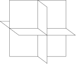

Slicevis
========



Dependencies
============

* `OpenGL` development libraries and headers

As submodules:

* `dear imgui,`
* `catch`
* `zmq`
* `cppzmq`
* `glfw3`
* `glm`
* `assimp`
* `tomopackets`
* `ASTRA toolbox`

Installation
============

Submodules
----------

First obtain the submodules.

```bash
git submodule update --init --remote
```

Next we build the submodules

**ZMQ**

```
cd ext/libzmq/
mkdir build
cd build
cmake ..
make -j8
```

**ASSIMP**

```
cd ext/assimp/
mkdir build
cd build
cmake ..
make -j8
```

**GLFW**

```
cd ext/assimp/
mkdir build
cd build
cmake ..
make -j8
```

Build slicevis:
---------------

```
cd build
cmake ..
make -j8
```

Authors
=======

Slicevis is developed by the Computational Imaging group at CWI. Main author:

- Jan-Willem Buurlage

Also thanks to:

- Holger Kohr
- Willem Jan Palenstijn
