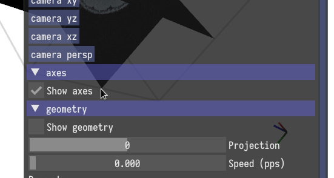
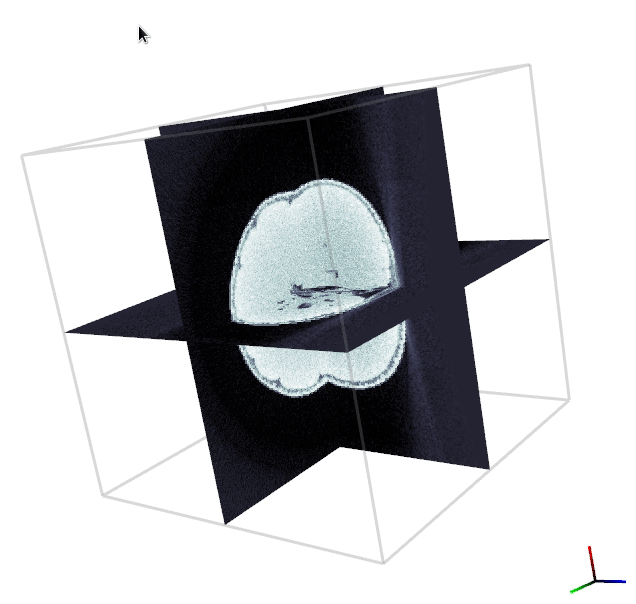
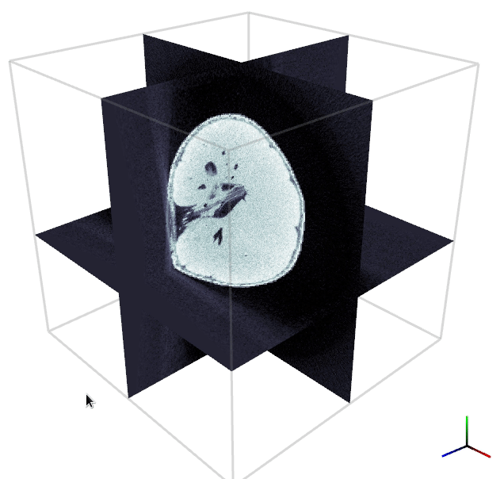

# RECAST3D User Guide

Here we discuss the user interface of RECAST3D. We assume that there is a scene
active, and that there is an active reconstruction server with non-zero
projection data.

## Menu bar

In the _Scenes_ tab of the menu bar, all the current scenes are listed.
Additional scenes can be added, or scenes can be deleted from this tab.

## Scene controls

On the left, there is a window with controls for the scene.

### Color scheme

A color scheme can be chosen with a picker interface.

### Fixed camera angles

You can set the camera in the scene to fixed angles, for example by focusing on
one of the three standard orthoslices.

You can always reset the camera to the _default position_ using the spacebar.

### Axes

You can toggle the visibility of the axes indicator. 

In the axis indicator; _red_, _green_, and _blue_ represent the $x$, $y$, and
$z$ axis respectively.

### Contrast

You can change the contrast in the scene using the min/max sliders at the bottom
of the window. It also shows a histogram of the reconstruction data.

## Camera and slice controls

### Zooming

You can zoom in, and out, using the scroll wheel on your mouse.

### Rotating the camera

Rotating the camera around the object can be done by pressing the *left* mouse
button while not _hovering_ over a slice, and dragging the mouse.

### Changing a slice

You can translate a slice by pressing the *left* mouse button while _hovering_
over a slice, and dragging the mouse. This will translate the slice along its
normal.

### Changing the orientation of a slice

You can rotate a slice around one of its edges, by pressing the *right* mouse
button while _hovering_ over a slice. It will rotate around the furthest edge
from where you click.

