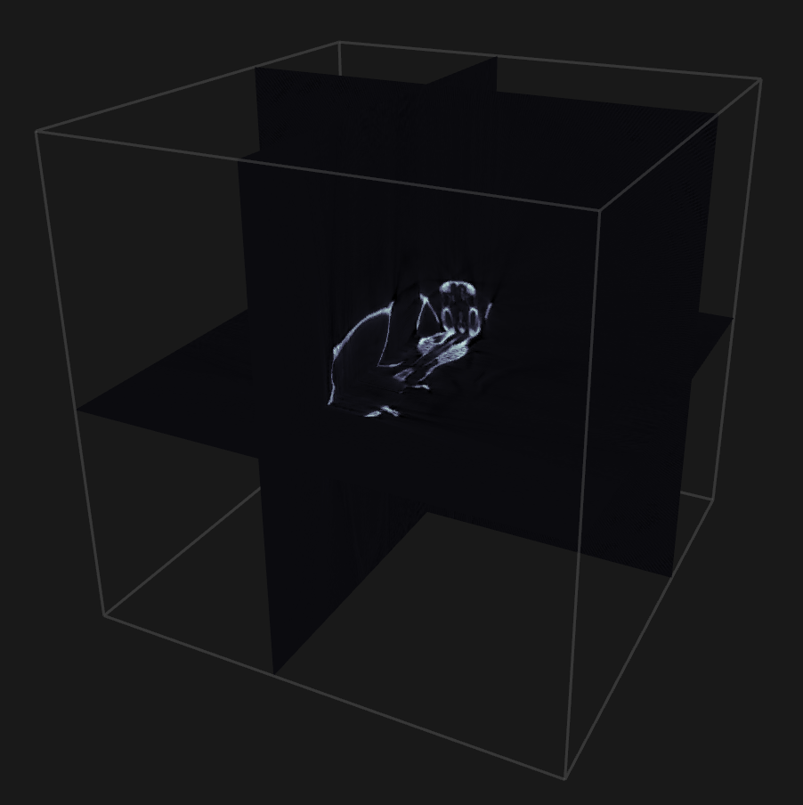

# Running the stack

## *Example*: Reconstruction of a rat skull

First, let us walk through a complete example before discussing each component in detail.

1. Download `skull.zip` from [doi:10.5281/zenodo.1164088](https://doi.org/10.5281/zenodo.1164088), and unzip it somewhere, say `~/data/skull`.

2. Install flexDATA, which is used in the data adapter we will use for this dataset.
```bash
conda install -c cicwi -c astra-toolbox/label/dev -c conda-forge -c owlas flexdata
```
3. Start up RECAST3D
```bash
recast3d
```
4. Start up a new scene
```bash
slicerecon_server --slice-size 512
```
5. Stream the data into RECAST3D
```bash
cd examples/adapters
python flexdata_adapter.py ~/data/skull --sample 2
```

You should now see the dataset loaded into RECAST3D.

{: style="height:450px;width:450px"}

## Starting RECAST3D

First, we have to start up RECAST3D. This either happens from the application launcher of your OS, or using a Linux terminal:

```bash
# Inside a conda environment with RECAST3D installed
conda activate [your_environment]
recast3d

# ... or inside the 'build' directory for a manual install
cd recast3d/build
./recast3d
```

## Starting the SliceRecon reconstruction server

After RECAST3D is running, we can start a reconstruction server. By default, we can run a SliceRecon server:

```bash
cd slicerecon/build
./slicerecon_server [options]
```

For example, with `[options]` we can set the slice resolution, preview resolution, and so on. For a full list of options, run with `-h`:

```bash
./slicerecon_server -h
```

When a server is started, it connects with RECAST3D and tells it to create a new scene. After starting the server, the RECAST3D window should show a new scene with three inactive slices.

## Pushing data into the SliceRecon server using an adapter

The server is now waiting until (projection) data is pushed to it. For example,
we can push prerecorded data from the FleX-ray lab:

```bash
cd examples/adapters
python flexdata_adapter.py [path]
```

## (Optional) plugins

To use or test (Python) plugins, we run the reconstruction server with `--pyplugin`.

```bash
./slicerecon_server --pyplugin [other options]
```

and start our plugin:

```bash
python plugin.py
```

After the plugin is started, we can push data to SliceRecon using any adapter.

To chain multiple plugins, simply change the outgoing host/port of a plugin to the incoming host/port of another. The final plugin should send the final processed slice data to RECAST3D using its host/port.

## Custom ports

The setup above works if you use the default ports, and when all components are run on `localhost`. The default ports are as follows:

- `5555`: RECAST3D `REQ/REP` server
- `5556`: RECAST3D `PUB/SUB` server
- `5558`: SliceRecon server
- `5652`: Python based plugin

These ports, as well as the host for RECAST3D or the (first) plugin, can be changed using flags to the SliceRecon server.

One of the reasons for being aware of which ports to use, is for forwarding data between nodes. For example, if we have a host `gpu_server` that we want to use for running a `slicerecon_server`, but we want to visualize using RECAST3D on our workstation `desktop`, we can 'reverse tunnel' ports `5555` and `5556` when using SSH to access our box as follows:

```bash
# on 'desktop'
recast3d
ssh gpu_server -R 5555:localhost:5555 -R 5556:localhost:5556
# ... now we are on 'gpu_server'
slicerecon_server --slice-size 512
# ... this will connect to the RECAST3D instance running on 'desktop'
```
